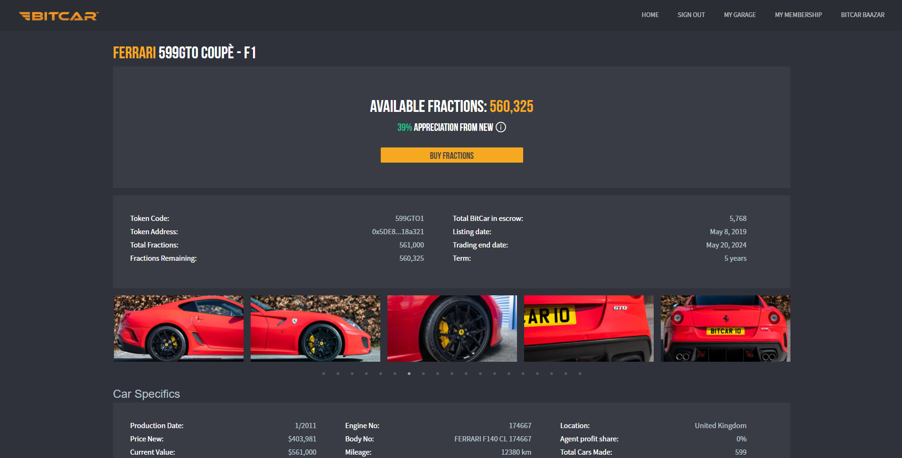

# BitCar Platform Frontend




## Detailed Content

**Front:**

- React JS (16.4.x+ - [github :link:](https://github.com/facebook/react))
- ant design (3.8+ [github :link:](https://github.com/ant-design/ant-design/))
- icon font are locally loaded
- Redux (_as your application grows managing state will be a serious concern, save pain with Redux_)
- React-Redux (_Redux is not specific to ReactJS, you could easily use it with Angular2 for instance_)
- redux-devtools-extension ([github :link:](https://github.com/zalmoxisus/redux-devtools-extension#redux-devtools-extension))
- React-Router-Redux (_previously named react-simple-router_)
- react-router (4.x- [github :link:](https://github.com/reactjs/react-router))
- animate.css ([github :link:](https://github.com/daneden/animate.css))
- classnames ([github :link:](https://github.com/JedWatson/classnames))
- react-motion ([github :link:](https://github.com/chenglou/react-motion))
- Webpack 4.x ([github :link:](https://github.com/webpack/webpack))
- babel 6+ ([github :link:](https://github.com/babel/babel))
- axios ([github :link:](https://github.com/mzabriskie/axios) _Why: simple, complete, isomorphic ..._)
- flow

**Tool chain:**

- babel 6+
- eslint
- webpack 3
- hot reload
- loaders
  - `js` / `jsx`
  - postcss
  - less
  - sass
  - css
  - json
  - images formats
  - svg and fonts formats

**tests:**

- Jest

## Usage

### Install

```bash
yarn install
```

### dev : hot reload mode (_+ redux-devtools-extension_)

```bash
yarn run start
```

### bundle production mode

```bash
yarn run prod
```


### bundle dev mode (_+ redux-devtools-extension_)

```bash
yarn run dev
```

### tests

```bash
yarn run test
```

### analyze

```bash
yarn run analyze
```